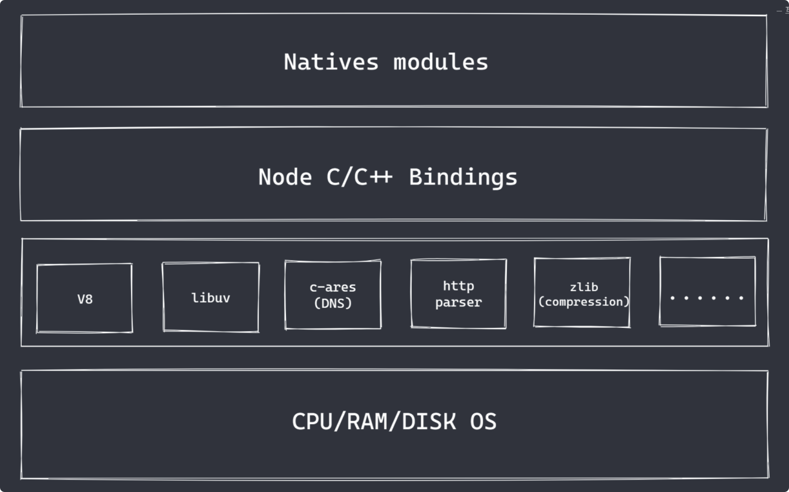

## nodeJS 架构

- **Natives modules**
  由js实现，提供应用程序可直接调用的库，如fs、path、http等内置核心模块
  无法操作底层硬件设备
- **BuiltIn modules** 
  Nodes与硬件设备通信的桥梁，由C/C++开发
- **底层**
  - V8:执行JS代码，转换为C/C++
  - libuv:事件循环、事件队列、异步IO
  - 其他第三方模块：zlib、c-ares、http-parser

## 为什么是nodeJS

除了网络带宽、硬件性能等，真正影响一个服务的速度的关键，是IO处理。

IO是计算机操作过程中最缓慢的环节

其他编程语言在处理IO操作时，采用的是基于多线程/多进程的并发操作

NodeJS采用了Reactor模式，单线程完成多线程工作，Reactor模式下实现异步IO、事件驱动

NodeJs更适用于IO密集型高并发请求，而不是CPU密集型的业务逻辑处理

## NodeJS异步IO

