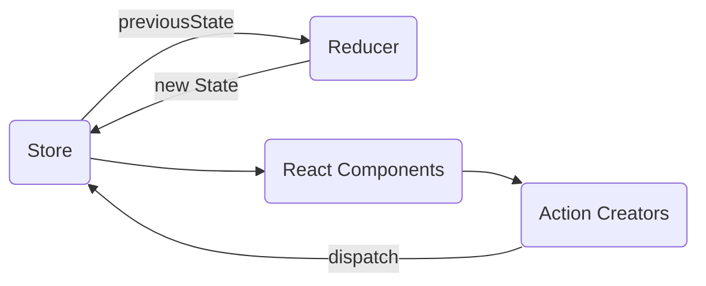

## 一、Redux概念简述

- Redux = Reducer + Flux

- 把公共数据放到store里面，组件改变store数据,其他组件感知到数据变化，从而更新组件

## 二、Redux工作流程

```mermaid
graph LR
	A(Store) --previousState--> B(Reducer)
	B(Reducer) --new State--> A(Store)
	C(Action Creators) --dispatch--> A(Store)
	A(Store) --> D(React Components)
	D(React Components)-->C(Action Creators)
```

